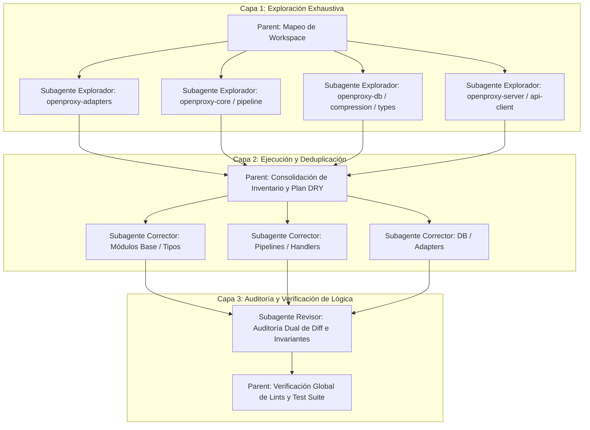

# Rust Modernization & Code Deduplication Skill

Guía operativa para auditar repositorios Rust, localizar código duplicado/boilerplate y modernizar implementaciones adoptando la stdlib contemporánea (Rust 1.80+ / 1.97+ y Edition 2024) con abstracciones zero-cost.

---

## 0. Criterios de Valor (ROI) y Reglas de Parada

Antes de ejecutar cualquier cambio, clasificar cada oportunidad detectada:

| Prioridad | Categoría | Condición de ejecución |
| :--- | :--- | :--- |
| **P1** | Eliminar dependencia externa (`once_cell` → `LazyLock`, etc.) | Siempre ejecutar |
| **P2** | Deduplicar lógica real (>10 líneas idénticas entre módulos) | Siempre ejecutar |
| **P3** | Extraer función de monolito >100 líneas | Solo si se agrega al menos 1 test unitario para la función extraída |
| **P4** | Modernizar syntax (`let-else`, `is_some_and`, `split_once`) | Solo si reduce ≥3 líneas netas por sitio de aplicación |
| **P5** | Cambiar firma `&str` vs `String` / eliminar `.clone()` cosmético | Solo con evidencia de `clone()` en call-site caliente (hot path medido o loop) |

### Regla de parada obligatoria:
- P1-P2: ejecutar siempre.
- P3: ejecutar si se cumplen los tests.
- P4-P5: agrupar como "cleanup cosmético" en UN solo commit al final. Si el diff de P1-P3 ya supera 300 líneas, **descartar P4-P5** de la sesión.
- **NUNCA** mezclar prioridades distintas en el mismo commit.

### Regla anti-bucle:
- Si un cambio de P4-P5 falla en compilar o testear al segundo intento, **descartarlo** y documentar como oportunidad futura.

---

## 1. Detección y Deduplicación Sistemática de Código

### 1.1 Patrones de Código Repetitivo Comunes

| Patrón Duplicado | Causa Común | Técnica de Deduplicación Idiomática |
| :--- | :--- | :--- |
| **Handlers / Endpoints HTTP** | Boilerplate repetido de request/response/headers | Macro declarativa (`macro_rules!`) o Middleware / Layer genérico |
| **Transformaciones / Parseo** | Bloques repetidos de validación o normalización | Extension Trait (`trait StrExt { ... } impl StrExt for str`) |
| **Adaptadores de Proveedores / APIs** | Múltiples clientes con endpoints casi idénticos | Trait con métodos default (`trait ProviderAdapter`) |
| **Construcción de Queries SQL** | Inserciones y placeholders repetitivos | Batch helper genérico o macro declarativa de inserción |
| **Conversión de Errores** | Múltiples bloques `.map_err(\|e\| ...)` idénticos | Implementaciones `From<SourceError>` o Extension Trait para `Result` |
| **Normalización de Payloads JSON** | Match arms repetidos en enums de variantes | Visitor pattern o helpers polimórficos (`serde_json::Value`) |
| **Reintentos / Callbacks Asíncronos** | Wrappers repetitivos con boxing de futures | Async Closures (`async || {}`) o traits `AsyncFn / AsyncFnMut` |

### 1.2 Estrategias de Deduplicación Zero-Cost

1. **Extension Traits (Blanket Implementations):**
   ```rust
   // Centraliza transformaciones comunes sin envolver tipos en nuevos structs
   pub trait ResponseExt {
       fn to_json_response(&self) -> Result<Response, Error>;
   }
   impl<T: serde::Serialize> ResponseExt for T {
       fn to_json_response(&self) -> Result<Response, Error> {
           // ...
       }
   }
   ```

2. **Macros Declarativas (`macro_rules!`):**
   ```rust
   // Deduplica implementaciones repetitivas de traits o adapters
   macro_rules! impl_provider_dispatch {
       ($enum_name:ident, $($variant:ident => $adapter:path),+ $(,)?) => {
           match self {
               $( $enum_name::$variant(inner) => inner.execute(req).await, )+
           }
       };
   }
   ```

3. **Traits con Métodos Default (Polimorfismo Estático):**
   ```rust
   pub trait ApiClient {
       fn base_url(&self) -> &str;
       fn client(&self) -> &reqwest::Client;
       
       // Método por defecto reusable
       fn endpoint_url(&self, path: &str) -> String {
           format!("{}/{}", self.base_url().trim_end_matches('/'), path.trim_start_matches('/'))
       }
   }
   ```

4. **Zero-Copy Transformation con `Cow<'a, T>`:**
   ```rust
   use std::borrow::Cow;

   // Evita asignaciones incondicionales de memoria cuando la entrada ya es válida
   pub fn sanitize_header(input: &str) -> Cow<'_, str> {
       if input.contains('\r') || input.contains('\n') {
           Cow::Owned(input.replace(['\r', '\n'], ""))
       } else {
           Cow::Borrowed(input) // Cero alloc
       }
   }
   ```

---

## 2. Catálogo de Modernización Idiomática de Rust (1.80+ / 1.97+ & 2024 Edition)

### 2.1 Reemplazo de Dependencias por Stdlib

| Dependencia Externa | Reemplazo Stdlib Nativo | Versión |
| :--- | :--- | :--- |
| `lazy_static!`, `once_cell::sync::Lazy` | `std::sync::LazyLock<T>` | 1.80+ |
| `once_cell::unsync::Lazy` | `std::cell::LazyCell<T>` | 1.80+ |
| `once_cell::sync::OnceCell` | `std::sync::OnceLock<T>` | 1.70+ |
| `once_cell::unsync::OnceCell` | `std::cell::OnceCell<T>` | 1.70+ |
| `atty`, `is-terminal` | `std::io::IsTerminal` | 1.70+ |
| `path-clean` | `std::path::absolute(&path)` | 1.79+ |
| `NonZeroU32`, `NonZeroUsize`, etc. | `std::num::NonZero<T>` genérico | 1.79+ |

- **`std::sync::LazyLock` (Nativo en static):**
  ```rust
  // ANTES (dependencia externa):
  // static REGEX: Lazy<Regex> = Lazy::new(|| Regex::new("...").unwrap());
  
  // AHORA (stdlib std::sync::LazyLock):
  static REGEX: std::sync::LazyLock<regex::Regex> = std::sync::LazyLock::new(|| {
      regex::Regex::new("...").expect("regex compilation failed")
  });
  ```

- **`std::sync::OnceLock` (Nativo thread-safe):**
  ```rust
  static CONFIG: std::sync::OnceLock<AppConfig> = std::sync::OnceLock::new();
  let cfg = CONFIG.get_or_init(AppConfig::load);
  ```

---

### 2.2 Control de Flujo, Pattern Matching y Errores

- **`let-else` para Validación y Salida Temprana:**
  ```rust
  // ANTES:
  let value = match opt {
      Some(v) => v,
      None => return Err(Error::NotFound),
  };
  
  // AHORA:
  let Some(value) = opt else {
      return Err(Error::NotFound);
  };
  ```

- **Predicados con `Option::is_some_and` y `Result::is_ok_and`:**
  ```rust
  // AHORA:
  if opt.is_some_and(|x| x > 10) { ... }
  ```

- **Inspección de Flujo (`inspect` / `inspect_err` - Rust 1.76+):**
  ```rust
  // Encadenamiento limpio para logging/trazas sin alterar el Result/Option
  let value = result.inspect_err(|e| tracing::warn!("Fallo al sincronizar: {e}"))?;
  ```

- **División de Strings con `str::split_once`:**
  ```rust
  // ANTES:
  let parts: Vec<&str> = text.splitn(2, '=').collect();
  if parts.len() == 2 { let (k, v) = (parts[0], parts[1]); }
  
  // AHORA:
  if let Some((k, v)) = text.split_once('=') {
      // ...
  }
  ```

- **Patrones de Rango Exclusivo (Half-Open Ranges - Rust 1.80+):**
  ```rust
  match status_code {
      200..300 => handle_success(),
      400..500 => handle_client_error(),
      _ => handle_other(),
  }
  ```

- **Inline Const Expressions (`const { ... }` - Rust 1.79+):**
  ```rust
  // Inicialización de arrays con tipos que no implementan Copy
  let buffers = [const { Vec::new() }; 16];
  
  // Aserciones e invariantes en tiempo de compilación dentro de funciones
  const { assert!(std::mem::size_of::<Header>() == 64) };
  ```

- **Detección Segura de Archivos (`std::fs::exists` - Rust 1.81+):**
  ```rust
  // Retorna io::Result<bool> sin silenciar fallos de permisos
  if std::fs::exists(&path).unwrap_or(false) {
      // ...
  }
  ```

---

### 2.3 Async, Concurrencia y Performance

- **Async Closures (`async || {}`) & `AsyncFn` (Rust 1.85+ / 2024):**
  ```rust
  // ANTES (Box<dyn Future> o Fn() -> Fut complejo):
  pub async fn retry_op<T, E, F, Fut>(mut f: F) -> Result<T, E>
  where F: FnMut() -> Fut, Fut: std::future::Future<Output = Result<T, E>> { ... }

  // AHORA (AsyncFn nativo zero-alloc):
  pub async fn retry_op<T, E, F>(mut op: F) -> Result<T, E>
  where F: AsyncFnMut() -> Result<T, E> {
      op().await
  }
  ```

- **AFIT & RPITIT con Precise Capturing `use<..>` (Rust 1.82+ / 2024):**
  ```rust
  pub trait StorageProvider {
      // Async fn nativo en trait (sin #[async_trait] ni Box)
      async fn fetch(&self, key: &str) -> Result<Vec<u8>, AppError>;
      
      // Control explícito de lifetimes capturados en impl Trait
      fn stream_events<'a>(&'a self) -> impl Iterator<Item = Event> + use<'a, Self>;
  }
  ```

- **`Arc::unwrap_or_clone` para Copy-on-Write Eficiente (Rust 1.76+):**
  ```rust
  // Evita clonar el contenido interno si el Arc es el único poseedor
  let data: Vec<u8> = Arc::unwrap_or_clone(shared_arc);
  ```

- **Formatting Directo sin Allocaciones Intermediarias:**
  ```rust
  // Reusar buffers en hot paths con write!
  use std::fmt::Write;
  let mut buf = String::with_capacity(64);
  let _ = write!(buf, "{base_url}/chat/completions");
  ```

---

### 2.4 Buenas Prácticas de Rust Edition 2024

1. **`core::error::Error` en Prelude:**
   - No requiere `use std::error::Error;` en código estándar o `#![no_std]`.
2. **Erradicación de `static mut`:**
   - Prohibido tomar referencias a `static mut`. Usar `std::sync::atomic::*`, `std::sync::LazyLock` o `std::sync::Mutex`.
3. **Punteros Raw Nativos (`&raw const` / `&raw mut`):**
   - Reemplaza `std::ptr::addr_of!` / `addr_of_mut!`.
4. **Liberación Estricta de Temporales en `if let`:**
   - Temporales (como `MutexGuard`) se destruyen al finalizar la condición `if let`, evitando deadlocks inadvertidos en ramas anidadas.

---

## 3. Protocolo de Ejecución: Pipeline de 3 Capas con Subagentes

Para evitar auditorías superficiales o pasadas incrementales incompletas, el proceso DEBE estructurarse de forma obligatoria en un pipeline de tres etapas especializadas con subagentes independientes:



---

### 3.1 Etapa 1: Exploración Exhaustiva Paralela (Subagentes `research`)

- **Objetivo:** Cada subagente examina a fondo un conjunto de crates asignados y emite un **Inventario de Oportunidades** sin modificar código.
- **Checklist de Búsqueda Obligatoria por Subagente:**
  1. *Estructuras & Duplicaciones:* Enums repetidos entre crates, match arms idénticos en adaptadores/handlers, duplicación de queries/transformaciones.
  2. *Control de Flujo:* Bloques `match` con retorno temprano candidatos a `let-else`, cadenas `is_some() && ...` a `is_some_and`.
  3. *Strings & Slices:* `.split(...).next()` a `.split_once(...)`, `.split('\n')` a `.lines()`.
  4. *Memoria & Concurrencia:* Reemplazo de `.clone()` innecesario por `Arc::unwrap_or_clone` o `Cow`, migración de `once_cell`/`lazy_static` a `std::sync::LazyLock`/`OnceLock`.
  5. *Errores & Linter:* Conversiones manuales `.map_err()` candidatas a `From` o traits de extensión.

- **Filtro de salida del inventario:**
  - Cada oportunidad DEBE incluir: **líneas afectadas** (estimado), **categoría de ROI** (P1-P5 según §0), y **riesgo** (bajo/medio/alto).
  - El parent **DESCARTA** oportunidades P4-P5 si el total de cambios P1-P3 ya supera 300 líneas de diff.
  - Oportunidades sin categoría asignada se rechazan.

---

### 3.2 Etapa 2: Aplicación Quirúrgica (Subagentes `self`)

- **Objetivo:** Refactorizar el código siguiendo la jerarquía lazy (Stdlib > DRY local > macro zero-cost > cambio mínimo).
- **Reglas de Ejecución:**
  - Aplicar cambios con parches mínimos y anclas precisas.
  - Compilar y validar el crate asignado en cada paso: `cargo test -p <crate>`.
  - Prohibido alterar contratos públicos o semántica de errores salvo orden explícita.
  - **Extracción de funciones >20 líneas:** agregar al menos 1 test unitario para la función extraída. Si es `pub` → test obligatorio. Si es `fn` privada cubierta por tests existentes → documentar qué test la cubre con `// Cubierto por test: <nombre>`.

---

### 3.3 Etapa 3: Revisión de Integridad Lógica (Subagente Auditor)

- **Objetivo:** Auditar el `git diff` completo antes de dar por cerrada la tarea para garantizar **cero pérdida de lógica**.
- **Preguntas Críticas de Auditoría:**
  - ¿Algún `let-else` cambió la rama de escape alterando el tipo o mensaje de error original?
  - ¿Algún `split_once` asumió separadores inexistentes rompiendo casos borde?
  - ¿Alguna deduplicación de tipos introdujo acoplamiento circular o dependencias innecesarias?
  - ¿Se agregaron tests para todas las funciones extraídas de >20 líneas?
- **Validación Final:**
  ```bash
  cargo clippy --workspace --all-targets -- -D warnings
  cargo test --workspace
  ```

---

### 3.4 Política de Commits

- **UN commit por categoría de cambio** (P1: dep removal, P2: dedup, P3: extraction, P4-P5: cosmético).
- **Mensaje con scope concreto:** `refactor(db): extract generic load_config_val/save_config_val`.
- **PROHIBIDO:** mensajes genéricos como "modernize idioms", "deduplicate boilerplate" o "modern rust idioms".
- Si todo el refactor cabe en <200 líneas de diff neto, squash en un solo commit.
- Si el diff supera 200 líneas, máximo 1 commit por categoría P (máx 3-4 commits por sesión).
