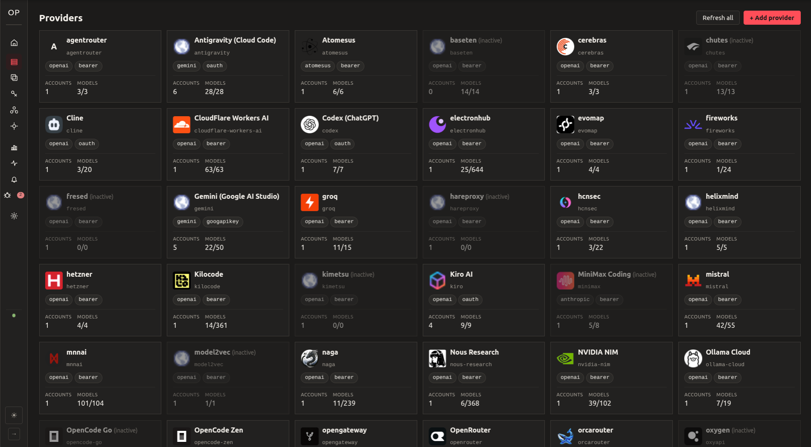
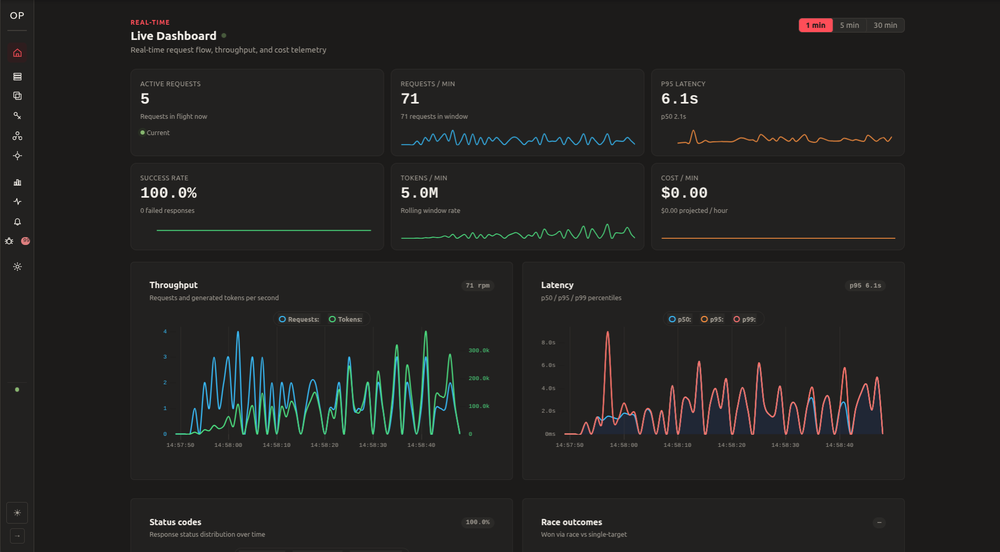

# openproxy ⚡

**Self-hosted LLM gateway that unifies, races, and failovers across multiple AI providers behind a single OpenAI-compatible API.**

[](https://github.com/soyelmismo/openproxy/actions/workflows/ci.yml)
[](https://github.com/soyelmismo/openproxy/releases)
[](LICENSE)
[](https://github.com/soyelmismo/openproxy/pkgs/container/openproxy)

```text
               ┌─────────────────────────────────────────────────────────┐
               │    Your AI Client (Cursor, Cline, Continue, Scripts)    │
               └────────────────────────────┬────────────────────────────┘
                                            │ OpenAI /chat/completions API
                                            ▼
               ┌─────────────────────────────────────────────────────────┐
               │                        openproxy                        │
               │  [ Router | Combos | Parallel Race | Telemetry | Auth ] │
               └───────┬────────────────────┬────────────────────┬───────┘
                       │                    │                    │
                       ▼                    ▼                    ▼
             ┌───────────────────┐┌───────────────────┐┌───────────────────┐
             │    OpenCode Zen   ││      Gemini       ││    OpenRouter     │
             │   (Free / Fast)   ││   (1M Context)    ││   (Fallback)      │
             └───────────────────┘└───────────────────┘└───────────────────┘
```



---

## Why openproxy?

- **Parallel Racing:** Query multiple providers in parallel. Stream the first valid response to your client and cancel losing requests.
- **Combos (Fallback Routing):** Chain models and accounts (`strict`, `round_robin`, `p2c`, `least_used`). If provider A hits rate limits or errors, openproxy fails over to provider B.
- **Self-Hosted:** Single binary with embedded SQLite and a web dashboard. No external databases, cloud accounts, or telemetry.
- **Protocol Translation:** Translates requests and SSE streams between OpenAI (`/chat/completions`), Anthropic (`/messages`), and Google Gemini formats.
- **Proxy Engine & Cooldowns:** Scrapes upstream proxies, runs health checks, and enforces persistent per-provider rate-limit backoffs.
- **Drop-in Compatibility:** Point any OpenAI-compatible client (**Cursor, Cline, Roo Code, Continue, Claude Code, LiteLLM, LangChain**) to openproxy by updating the base URL.

---



---

## Key Features

- **⚡ OpenAI-Compatible API:** `POST /v1/chat/completions` (streaming SSE and non-streaming) and `GET /v1/models`.
- **🔌 Multi-Provider Support:** Built-in adapters for OpenRouter, MiniMax, OpenCode (Zen & Go), Ollama Cloud, Nous Research, NVIDIA NIM, Kilocode, Gemini (AI Studio + Cloud Code), Antigravity (+ CLI), Kiro, Cloudflare Workers AI, and custom endpoints.
- **🏁 Parallel Races:** Launch $N$ targets concurrently. First token wins; losing requests abort within configurable grace periods.
- **🔄 Combos & Load Balancing:** Group providers, models, and accounts into virtual models with weighted routing, power-of-two-choices (`p2c`), and nested sub-combos.
- **🛡️ Circuit Breakers & Cooldowns:** Fault detection with configurable per-account and per-target backoff cooldowns.
- **🌐 Proxy Rotation & Rate-Limit Isolation:** Proxy health tracking and isolated per-provider cooldowns on HTTP 429 responses.
- **📊 Embedded Dashboard:** Web UI (TypeScript + Lit + uPlot) bundled in the binary at `/admin`. Live WebSocket feed, throughput metrics, latency percentiles ($p50/p95/p99$), and cost tracking.
- **🔔 Notifications:** Alerts for discovered models, auto-activation rules, and drag-and-drop assignment to combos.
- **🔐 Encrypted Storage:** Upstream API keys and OAuth tokens are encrypted at rest with AES-256-GCM.
- **🗜️ Payload Compression (Lite & RTK):** System-prompt deduplication and CLI output compaction (`git`, `cargo`, `npm`, `docker`) to reduce token usage.

---

## Quick Start

### Option A: Docker (Recommended)

Run the official multi-arch image (`linux/amd64`, `linux/arm64`):

```bash
# Pull the latest image
docker pull ghcr.io/soyelmismo/openproxy:latest

# Run with a mounted config file and volume for SQLite data
docker run -d \
  --name openproxy \
  -p 8787:8787 \
  -v $(pwd)/config.toml:/etc/openproxy/config.toml:ro \
  -v openproxy-data:/var/lib/openproxy \
  --restart unless-stopped \
  ghcr.io/soyelmismo/openproxy:latest
```

Or using **Docker Compose**:

```bash
cp config.example.toml config.toml
docker compose up -d
```

---

### Option B: Pre-Built Binary

Download the executable for your architecture from [Releases](https://github.com/soyelmismo/openproxy/releases):

| Target | Platform |
| --- | --- |
| `x86_64-unknown-linux-gnu` | Linux (x86_64) |
| `aarch64-unknown-linux-gnu` | Linux (ARM64) |
| `x86_64-pc-windows-msvc` | Windows (x86_64) |
| `aarch64-apple-darwin` | macOS (Apple Silicon) |

```bash
# Extract and run
./openproxy --config config.toml
```

---

### Option C: Build from Source

Requirements: **Rust 1.80+**, **Node 20+**, and **pnpm**.

```bash
git clone https://github.com/soyelmismo/openproxy.git
cd openproxy

# 1. Build the embedded web dashboard
cd crates/openproxy-server/web && pnpm install && pnpm build && cd ../../..

# 2. Build the single binary
cargo build --release -p openproxy-server

# 3. Start openproxy
./target/release/openproxy --config config.toml
```

The dashboard is available at `http://127.0.0.1:8787/admin`.

---

## Usage

Point your AI tool (Cline, Cursor, Roo Code, Python, etc.) to openproxy:

```bash
curl http://127.0.0.1:8787/v1/chat/completions \
  -H "Authorization: Bearer YOUR_OPENPROXY_KEY" \
  -H "Content-Type: application/json" \
  -d '{
    "model": "gpt-4o",
    "messages": [{"role": "user", "content": "Hello world!"}],
    "stream": true
  }'
```

### Compatible Integrations

| Tool | Base URL Configuration |
| :--- | :--- |
| **Cursor / Cline / Roo Code** | `http://127.0.0.1:8787/v1` |
| **Continue.dev** | `http://127.0.0.1:8787/v1` |
| **OpenAI Python SDK** | `client = OpenAI(base_url="http://127.0.0.1:8787/v1", api_key="...")` |
| **LangChain / LlamaIndex** | `openai_api_base="http://127.0.0.1:8787/v1"` |

---

## Documentation

- [`docs/architecture.md`](docs/architecture.md): System architecture, routing pipeline, and internals.
- [`docs/mvp-spec.md`](docs/mvp-spec.md): Endpoint specifications, schema, and security models.
- [`docs/roadmap.md`](docs/roadmap.md): Post-MVP roadmap and planned capabilities.

---

## License

Licensed under the [GNU General Public License v3.0](LICENSE).
