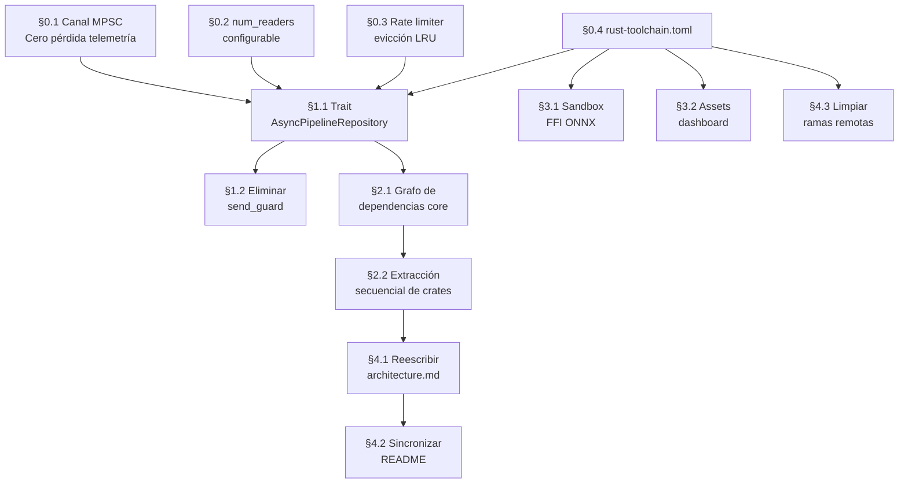

# Plan de Acción: openproxy — Deuda Técnica Verificada

> Basado en la auditoría forense contra código fuente real. Excluye mitos desmentidos (WAL ya existe, WS ya autenticado, rate limiter upstream ya es predictivo, proxies son opt-in, 23 adaptadores y 6 modos existen).

---

## Fase 0 — Estabilización Inmediata (Sin Refactor Estructural)

### 0.1 Canal MPSC de Telemetría: Cero Pérdida de Registros

**Problema:** [`usage_tracker.rs:568`](file:///root/proyectos/openproxy/crates/openproxy-pipeline/src/usage_tracker.rs#L568) ejecuta `try_send` sobre el canal MPSC de 1024 slots. Si el buffer se satura bajo ráfagas sostenidas, emite `tracing::warn!` y **descarta el job silenciosamente**. La telemetría de facturación, costes y reputación de proveedores miente bajo carga pico.

**Acción:**
1. Sustituir `try_send` + drop por un **buffer circular de desbordamiento en memoria** (ring buffer acotado, ej. 8192 slots) que absorba picos sin perder registros.
2. Alternativamente, implementar backpressure controlada: si el canal está lleno, aplicar `send().await` con timeout corto + persistencia a un archivo WAL auxiliar local que el worker drene en el siguiente ciclo idle.
3. Añadir métrica `counter!("telemetry.mpsc.drops")` para visibilizar la tasa de descarte en producción antes y después del cambio.

**Crate:** `openproxy-pipeline`  
**Archivos:** [`usage_tracker.rs`](file:///root/proyectos/openproxy/crates/openproxy-pipeline/src/usage_tracker.rs), [`worker.rs`](file:///root/proyectos/openproxy/crates/openproxy-pipeline/src/worker.rs)  
**Riesgo:** Bajo — cambio local al canal de persistencia.

---

### 0.2 Pool de Lectores SQLite: Parametrizar `num_readers`

**Problema:** [`conn.rs`](file:///root/proyectos/openproxy/crates/openproxy-db/src/conn.rs) fija `let num_readers = 2;`. Con WAL mode activo, SQLite soporta lectores concurrentes no bloqueantes. Dos lectores serializan toda la carga de auth, `/v1/models`, combos y admin innecesariamente.

**Acción:**
1. Exponer `num_readers` como parámetro configurable en `config.toml` con default dinámico: `std::thread::available_parallelism().map(|n| n.get().min(8)).unwrap_or(4)`.
2. Documentar en `config.example.toml` el rango recomendado (2–16) y su impacto en contención de lectura.

**Crate:** `openproxy-db`  
**Archivos:** [`conn.rs`](file:///root/proyectos/openproxy/crates/openproxy-db/src/conn.rs)  
**Riesgo:** Bajo — cambio de inicialización sin alterar interfaces.

---

### 0.3 Rate Limiter de Ingreso: Corregir Reset Global

**Problema:** En [`rate_limit.rs`](file:///root/proyectos/openproxy/crates/openproxy-core/src/rate_limit.rs), al alcanzar la capacidad máxima (100K entradas), si el cleanup lazy no libera espacio, ejecuta `self.windows.clear()`, reseteando **todos los contadores** a cero simultáneamente para todos los clientes.

**Acción:**
1. Sustituir `clear()` por evicción LRU parcial: eliminar el 25% de entradas más antiguas por timestamp, preservando el estado de los clientes activos.
2. Añadir métrica `counter!("rate_limit.evictions")` para monitorear la frecuencia de limpieza.

**Crate:** `openproxy-core`  
**Archivos:** [`rate_limit.rs`](file:///root/proyectos/openproxy/crates/openproxy-core/src/rate_limit.rs)  
**Riesgo:** Bajo — la lógica está autocontenida.

---

### 0.4 Congelar Toolchain

**Problema:** `edition = "2024"` + `rust-version = "1.96"` sobre rustc 1.97 es un moving target que dificulta contribuciones externas y reproducibilidad de CI.

**Acción:**
1. Crear `rust-toolchain.toml` canónico:
   ```toml
   [toolchain]
   channel = "1.97.1"
   components = ["clippy", "rustfmt"]
   ```
2. Fijar MSRV explícito en `Cargo.toml` del workspace y validarlo en CI con `cargo msrv verify`.

**Archivos:** Raíz del workspace.  
**Riesgo:** Nulo.

---

## Fase 1 — Aislamiento de Concurrencia (Trait Async para el Pipeline)

### 1.1 Trait `AsyncPipelineRepository`

**Problema:** [`SqlitePipelineRepository`](file:///root/proyectos/openproxy/crates/openproxy-pipeline/src/repository.rs#L130-L165) implementa métodos síncronos que toman `self.conn.lock()`. Cada llamada desde el pipeline asíncrono requiere un `spawn_blocking` explícito por el caller. Esto deja **145 callsites de producción** donde un `spawn_blocking` faltante o un `.await` insertado entre lock y drop congela el runtime de Tokio. La feature `send_guard` de `parking_lot` ([`Cargo.toml:34`](file:///root/proyectos/openproxy/Cargo.toml#L34)) impide que el compilador detecte el error por sistema de tipos; solo `clippy::await_holding_lock` lo atrapa estáticamente.

**Acción:**
1. Definir un trait asíncrono puro en `openproxy-pipeline`:
   ```rust
   pub trait AsyncPipelineRepository: Send + Sync {
       async fn get_combo(&self, id: &ComboId) -> Result<Option<Combo>>;
       async fn get_target_credentials(&self, id: &TargetId) -> Result<Option<Credentials>>;
       // ... demás métodos del pipeline
   }
   ```
2. La implementación SQLite encapsula internamente el `spawn_blocking` + `conn.lock()`:
   ```rust
   impl AsyncPipelineRepository for SqlitePipelineRepository {
       async fn get_combo(&self, id: &ComboId) -> Result<Option<Combo>> {
           let conn = Arc::clone(&self.conn);
           let id = id.clone();
           tokio::task::spawn_blocking(move || {
               let conn = conn.lock();
               openproxy_db::combos::get(&conn, &id)
           }).await?
       }
   }
   ```
3. Los stages del pipeline (`decision.rs`, `target.rs`, `router.rs`, `executor/`) llaman directamente al trait async — **sin jamás ver un lock ni un `spawn_blocking`**.
4. Reducción esperada: de ~145 `spawn_blocking` dispersos a ~20–30 centralizados en la implementación del trait.

**Crates:** `openproxy-pipeline`, `openproxy-db`  
**Riesgo:** Medio — requiere actualizar firmas en todos los stages. Tests existentes validan la paridad funcional.

---

### 1.2 Evaluar Eliminación de `send_guard`

**Problema:** Con el trait async en su lugar, el guard de `parking_lot::Mutex` nunca debería cruzar un `.await` por construcción. La feature `send_guard` deja de ser necesaria y su presencia anula la protección del compilador.

**Acción:**
1. Una vez completado §1.1, verificar que ningún `MutexGuard` cruce un `.await` en el workspace.
2. Eliminar `features = ["send_guard"]` de `parking_lot` en [`Cargo.toml:34`](file:///root/proyectos/openproxy/Cargo.toml#L34).
3. Compilar: cualquier cruce de lock+await ahora será un error de compilación (`MutexGuard` no es `Send`), no un lint.

**Riesgo:** Bajo tras §1.1 — el compilador señala directamente los puntos que violen el invariante.

---

## Fase 2 — Desacoplamiento Semántico de `openproxy-core`

### 2.1 Análisis del Grafo de Dependencias Internas

**Problema:** `openproxy-core` alberga 40+ módulos con acoplamientos cruzados:

```
discovery_scheduler ──→ models ──→ notifications
         │                ▲
         ▼                │
     accounts ◄───────────┤
         │                │
         ▼                │
    providers ────────────┘
```

Módulos como `free_proxies/scrapers.rs` (HTTP async), `oauth` (refresh de tokens), `analytics`, `pricing`, `audio` y `embeddings` comparten dependencias transitivas a través de `crate::notifications` y `crate::models`.

**Acción:**
1. **Inventario formal:** Ejecutar `cargo modules dependencies` o generar el grafo con `cargo depgraph` limitado a `openproxy-core` para mapear cada arco interno.
2. **Definir contratos en `openproxy-types`:**
   ```rust
   // openproxy-types/src/traits.rs
   pub trait AccountStore: Send + Sync { ... }
   pub trait EventPublisher: Send + Sync { ... }
   pub trait ModelRegistry: Send + Sync { ... }
   ```
3. **Invertir dependencias:** Los módulos candidatos a extracción (`oauth`, `discovery_scheduler`, `free_proxies`, `analytics`) dependen de los traits abstractos, no de implementaciones concretas de otros módulos de `core`.

### 2.2 Extracción Secuencial de Crates

Orden de extracción de menor a mayor acoplamiento:

| Orden | Crate Nuevo | Módulos Extraídos | Dependencia Principal |
| :---: | :--- | :--- | :--- |
| 1 | `openproxy-analytics` | `analytics/`, `pricing/` | `openproxy-types`, `openproxy-db` |
| 2 | `openproxy-oauth` | `oauth/` | `openproxy-types`, `openproxy-db` |
| 3 | `openproxy-discovery` | `discovery_scheduler`, `free_proxies/` | `openproxy-types`, `openproxy-db` |
| 4 | `openproxy-notifications` | `notifications/` | `openproxy-types` |

**Invariante:** El DAG de crates debe permanecer acíclico tras cada extracción. Validar con `cargo modules dependencies --no-transitive` después de cada paso.

**Riesgo:** Alto en aislamiento — Medio si se ejecuta secuencialmente con tests de regresión entre cada extracción.

---

## Fase 3 — Seguridad y Aislamiento

### 3.1 Sandbox para FFI ONNX (Laya Engine)

**Problema:** [`laya_engine.rs`](file:///root/proyectos/openproxy/crates/openproxy-adapters/src/adapters/laya_engine.rs) enlaza dinámicamente `libonnxruntime.so` vía `dlopen` en el mismo espacio de direccionamiento que la master key AES y los tokens OAuth. Un buffer overflow en la librería de C es RCE directo con acceso a todas las credenciales.

**Acción:**
1. Aislar la inferencia ONNX en un **proceso worker hijo** que se comunique vía Unix socket o pipe con el proceso principal.
2. El worker carga `libonnxruntime.so` en su propio address space. Si el proceso hijo muere por SIGSEGV/SIGABRT, el gateway principal permanece ileso.
3. Protocolo IPC: serialización mínima (capnproto / flatbuffers / bincode) para tensores de entrada/salida.
4. Alternativa ligera: `seccomp-bpf` o `landlock` para restringir las syscalls del proceso que carga la FFI.

**Crate:** `openproxy-adapters`  
**Riesgo:** Medio — requiere rediseñar el ciclo de vida del motor de inferencia.

### 3.2 Assets del Dashboard en Producción

**Problema:** Servir los bundles JS/CSS sin credenciales es el estándar de cualquier SPA (la pantalla de login necesita renderizar). Pero los source maps y la estructura de endpoints quedan expuestos.

**Acción:**
1. Añadir opción `admin.strip_source_maps = true` en `config.toml` para excluir archivos `.map` del embebido de `rust-embed` en builds de producción.
2. Ofrecer `admin.bind_address` separado del listener del proxy (ej. `127.0.0.1:9091` vs `0.0.0.0:8080`) para que el dashboard solo sea accesible desde localhost o VPN.

**Crate:** `openproxy-server`  
**Riesgo:** Bajo.

---

## Fase 4 — Documentación y Gobernanza

### 4.1 Reescribir `docs/architecture.md`

**Problema:** [`docs/architecture.md:14`](file:///root/proyectos/openproxy/docs/architecture.md#L14) describe *"three providers and two routing strategies"* y menciona `r2d2`. El sistema real tiene 23 adaptadores, 6 modos de prioridad, pipeline por stages, race engine, PII nativo y rate limiter predictivo de 256 shards.

**Acción:**
1. Documentar el DAG de crates actual con responsabilidades reales.
2. Describir el pipeline por stages (`decision → router → target → executor → quota → telemetry`).
3. Documentar el flujo de persistencia: canal MPSC → worker batching → SQLite WAL.
4. Documentar el rate limiter dual: ingreso HTTP vs predictivo upstream.

### 4.2 Sincronizar README con el Sistema de Tipos

**Problema:** El README enumera 12 adaptadores representativos y 5 estrategias. El sistema de tipos define 23 y 6 respectivamente.

**Acción:** Generar las tablas del README desde los enums de `openproxy-types` y `openproxy-adapters` (script de CI o macro `include!` en el README).

### 4.3 Limpiar Ramas Remotas

**Problema:** 200+ ramas remotas, decenas de `fix/sec_*` y ramas de parches históricos ya mergeados.

**Acción:**
1. Script de limpieza: eliminar ramas remotas cuyo HEAD ya esté contenido en `main` (`git branch -r --merged main`).
2. Proteger ramas de release y desarrollo activo.

---

## Matriz de Prioridad y Dependencias



| Fase | Esfuerzo | Impacto | Riesgo |
| :--- | :---: | :---: | :---: |
| **0 — Estabilización** | Bajo (2–4 días) | Alto | Bajo |
| **1 — Trait Async** | Medio (1–2 semanas) | Crítico | Medio |
| **2 — Desacoplamiento Core** | Alto (3–5 semanas) | Alto | Medio-Alto |
| **3 — Seguridad FFI** | Medio (1–2 semanas) | Medio | Medio |
| **4 — Documentación** | Bajo (2–3 días) | Medio | Nulo |
