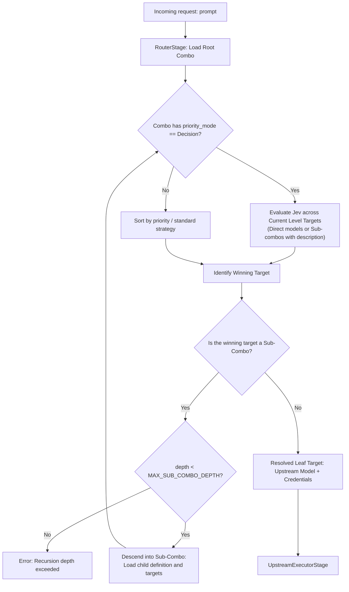

# Hierarchical Decision Routing

**Document:** `docs/hierarchical-decision-routing.md`  
**Status:** Design Proposal / Technical Specification  
**Date:** September 21, 2026  
**Authors:** OpenProxy Core Team  

---

## 1. Executive Summary and Motivation

OpenProxy currently supports real-time semantic routing via **System One** (fast decision models such as `jev-1.13` or `laya`) through the `priority_mode = "decision"` mode. However, the current sub-combo resolution (`sub_combo_id`) executes **statically and flattened** (`flatten_sub_combos` in `execution.rs`), expanding all sub-combos into leaf models before the routing engine evaluates any priority.

This limitation prevents cascading routing architectures ("Semantic Decision Trees"), such as:
```text
Client → Question: "How do I calculate the NPV of an investment?"
           ↓
    Combo "Topics" (Jev Router Level 1)
           ├─ combo:finance   ("Financial questions, balance sheets, investments, NPV/IRR")  <-- [WINNER]
           ├─ combo:health    ("Medical inquiries and diagnostics")
           ├─ combo:chat      ("Casual conversation, greetings")
           └─ combo:politics  ("Current events and politics")
           ↓
    Combo "Finance" (Jev Router Level 2)
           ├─ claude-3-5-sonnet ("Complex financial calculations and mathematical formulation") <-- [WINNER]
           └─ gpt-4o-mini       ("Basic concepts and simple definitions")
           ↓
    Upstream execution with Claude 3.5 Sonnet
```

The goal of this specification is to define the architecture required to support **recursive hierarchical routing**, where each level of the combo tree can act as an independent semantic classifier before descending to the next level.

---

## 2. Current State Diagnosis

### 2.1 Premature Static Flattening
In `crates/openproxy-pipeline/src/stages/router.rs`:
```rust
async fn resolve_initial_targets(
    ctx: &PipelineContext,
    combo: &openproxy_types::combos::Combo,
) -> Result<Vec<ComboTarget>, CoreError> {
    let targets = ctx
        .pipeline
        .resolve_targets(combo, ctx.req.targets_override.as_deref())
        .await?;
    ctx.pipeline.flatten_targets(&combo.id, targets).await
}
```
* `flatten_targets` calls `repo.resolve_combo_to_targets(sub_id, ...)`.
* This immediately replaces the sub-combo's `ComboTarget` (which contained `description = "Financial questions..."`) with the flat list of models inside that sub-combo.
* **Consequence:** The sub-combo description is lost, and the parent combo never classifies between sub-combos.

### 2.2 Decoupled Sub-Combo Policies
When flattening the list to individual models:
* The child combo is never evaluated as an entity with its own strategy (`priority`, `round_robin`, `decision`, etc.).
* The child combo's `priority_mode: Decision` property is never executed.

---

## 3. Hierarchical Routing Architecture

### 3.1 Recursive Stage-Based Execution Flow



### 3.2 Stop Rules and Resilience
1. **Depth Limit:** Maximum 5 levels (`MAX_SUB_COMBO_DEPTH = 5`). Cycle detection prevents infinite loops at runtime.
2. **Timeout or Jev Error Fallback:** If the Jev call at any level exceeds `decision_timeout_ms` (default 150ms) or fails, the router at that level falls back to the default static priority order and continues the flow without disrupting the user's request.
3. **Unhealthy Sub-Combo Pruning:** A sub-combo is only eligible for Jev classification if it has at least one healthy model in the `CircuitBreaker`. If a sub-combo is fully degraded, it is omitted from the options passed to Jev.

### 3.3 Audit Trail and Telemetry (`combo_walk_log`)
The request context (`PipelineContext`) accumulates the decision path for full observability in the dashboard logs:
```json
[
  "decision_router:combo=topics:winner=sub_combo:finance (elapsed=42ms)",
  "decision_router:combo=finance:winner=model:claude-3-5-sonnet (elapsed=38ms)"
]
```

---

## 4. Implementation Plan (Phased)

| Phase | Scope | Description |
| :--- | :--- | :--- |
| **Phase 1** | **Frontend SPA** | Refactor combo visualization in the Dashboard: group sub-combos into collapsible accordion blocks with distinct colors, internal model inspection, and inline editing. |
| **Phase 2** | **Core & Pipeline** | Modify `RouterStage` to replace blind initial flattening with hierarchical resolution and `PriorityMode::Decision` evaluation at the sub-combo level. |
| **Phase 3** | **Observability** | Expose hierarchical decision jump breakdowns in the real-time log and the Analytics tab. |

---

## 5. Quality Invariants
* Zero regressions in the current flat mode (`flatten_targets`).
* Compliance with the 800 LOC per file modular limit.
* Added Jev latency for sub-combos contained within $\le 50\text{--}100\text{ ms}$ per hop via parallel/optimized System One binary-format calls.
